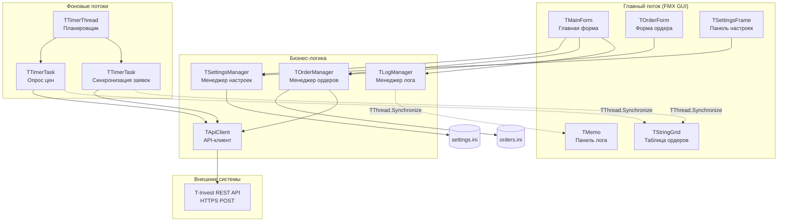
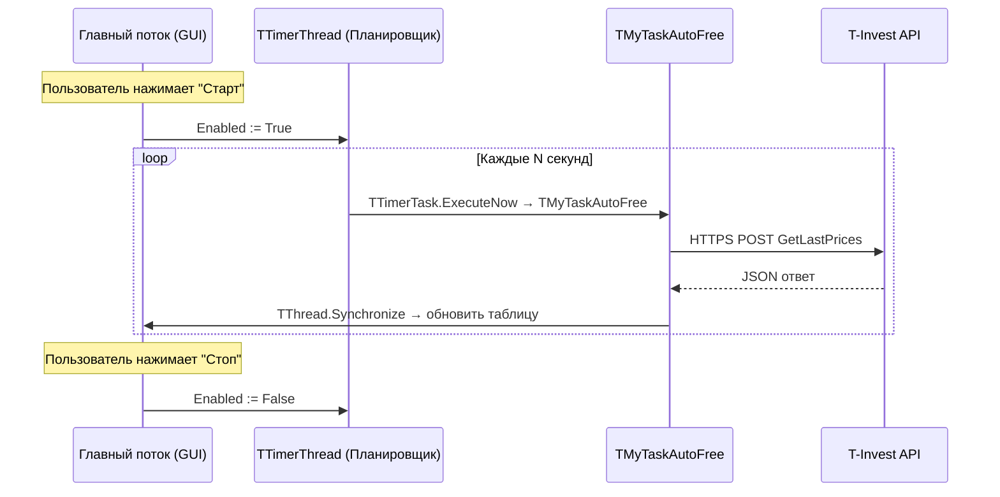

# Дизайн: Торговый робот MVP ("Кормилец")

## Обзор

Торговый робот реализуется как FMX-приложение на Delphi 11+ с модульной архитектурой. Ядро системы состоит из четырёх основных компонентов: API-клиент для работы с T-Invest REST API, менеджер настроек для персистентности конфигурации, менеджер ордеров для управления торговыми заявками и планировщик для периодических фоновых задач. Все компоненты используют существующие Core-модули проекта (TMyHttpClient, TTimerThread, TMySaveIniFile, TMyCriticalSection и др.).

Приложение работает в однопроцессном режиме с фоновыми потоками для API-запросов. Главный поток управляет GUI (FMX), фоновые потоки выполняют сетевые операции и синхронизацию данных. Взаимодействие между потоками осуществляется через потокобезопасные коллекции и флаги из Core-модулей.

## Архитектура

### Общая схема



### Потоковая модель



### Принципы архитектуры

1. **Разделение ответственности**: GUI не выполняет сетевых операций. Все API-вызовы происходят в фоновых потоках.
2. **Core-модули**: Все потоки, синхронизация, HTTP, INI — только через модули из `Source/Core/`.
3. **Потокобезопасность**: Данные, разделяемые между потоками (список ордеров, настройки), защищены через `TMyCriticalSection` и `TMyThreadList`.
4. **Обновление GUI**: Фоновые потоки обновляют интерфейс только через `TThread.Synchronize` или `TMyTaskSynchronizedAutoFree`.

## Компоненты и интерфейсы

### 1. TApiClient — API-клиент

Модуль: `Source/UApiClient.pas`

Отвечает за все HTTP-взаимодействия с T-Invest REST API. Использует `TMyHttpClient` для HTTPS-запросов. Все методы потокобезопасны и могут вызываться из фоновых потоков.

```pascal
type
  TApiClient = class
  private
    FBaseUrl: string;
    FToken: string;
    FProxyHost: string;
    FProxyPort: Integer;
    FProxyUser: string;
    FProxyPass: string;
    FCritSection: TMyCriticalSection;

    function DoPost(const AEndpoint, ARequestBody: string;
      out AResponse: string; out AStatusCode: Integer): Boolean;
    function BuildAuthHeader: string;
  public
    constructor Create;
    destructor Destroy; override;

    // Настройка подключения
    procedure SetToken(const AToken: string);
    procedure SetProxy(const AHost: string; const APort: Integer;
      const AUser, APass: string);

    // API-методы (Требования 2, 5, 6, 7, 8)
    function GetAccounts(out AResponse: string; out AStatusCode: Integer): Boolean;
    function GetLastPrices(const AInstrumentIds: TArray<string>;
      out AResponse: string; out AStatusCode: Integer): Boolean;
    function PostOrder(const AAccountId, AInstrumentId: string;
      const AQuantity: Integer; const ADirection: TOrderDirection;
      const AOrderType: TOrderType; const APrice: Double;
      out AResponse: string; out AStatusCode: Integer): Boolean;
    function CancelOrder(const AAccountId, AOrderId: string;
      out AResponse: string; out AStatusCode: Integer): Boolean;
    function GetOrders(const AAccountId: string;
      out AResponse: string; out AStatusCode: Integer): Boolean;
  end;
```

**Решение по дизайну**: `TApiClient` создаёт новый экземпляр `TMyHttpClient` для каждого запроса через классовые методы `HttpsClientPost`. Это проще и безопаснее для многопоточности, чем держать один экземпляр. Настройка прокси и токена происходит через `TMyHttpClient.OnConfigureClient` callback.

### 2. TSettingsManager — Менеджер настроек

Модуль: `Source/USettingsManager.pas`

Управляет загрузкой/сохранением настроек приложения через `TMySaveIniFile`.

```pascal
type
  TAppSettings = record
    Token: string;
    ProxyHost: string;
    ProxyPort: Integer;
    ProxyUser: string;
    ProxyPass: string;
    AccountId: string;
    PollIntervalSec: Integer;  // 30..120
  end;

  TSettingsManager = class
  private
    FIniFile: TMySaveIniFile;
    FSettings: TAppSettings;
    FCritSection: TMyCriticalSection;
  public
    constructor Create(const AIniPath: string);
    destructor Destroy; override;

    procedure Load;
    procedure Save;
    function GetSettings: TAppSettings;
    procedure SetSettings(const ASettings: TAppSettings);
  end;
```

**Решение по дизайну**: `TMySaveIniFile` создаётся с `SavePeriodSec = 5` для продолжительной работы. Настройки хранятся в секции `[Connection]` INI-файла. Токен сохраняется как есть (шифрование — за рамками MVP).

### 3. TOrderManager — Менеджер ордеров

Модуль: `Source/UOrderManager.pas`

Управляет списком ордеров, их персистентностью и статусами.

```pascal
type
  TOrderDirection = (odBuy, odSell);
  TOrderType = (otMarket, otLimit, otBestPrice);
  TOrderStatus = (osNew, osPending, osFilled, osRejected, osCancelled, osUnknown);

  TOrderRecord = record
    Id: Integer;                // Локальный ID
    InstrumentId: string;       // FIGI или instrument_uid
    Ticker: string;             // Тикер для отображения
    Direction: TOrderDirection;
    Quantity: Integer;          // Количество лотов
    OrderType: TOrderType;
    TargetPrice: Double;        // Целевая цена (для лимитных)
    CurrentPrice: Double;       // Текущая рыночная цена
    Status: TOrderStatus;
    ExchangeOrderId: string;    // Биржевой ID заявки (из ответа API)
  end;

  TOrderManager = class
  private
    FOrders: TMyThreadList<TOrderRecord>;
    FIniFile: TMySaveIniFile;
    FNextId: Integer;

    procedure SaveToIni;
    procedure LoadFromIni;
  public
    constructor Create(const AIniPath: string);
    destructor Destroy; override;

    function AddOrder(const AOrder: TOrderRecord): Integer;
    procedure UpdateOrder(const AOrder: TOrderRecord);
    procedure DeleteOrder(const AId: Integer);
    function GetOrder(const AId: Integer): TOrderRecord;
    function GetAllOrders: TArray<TOrderRecord>;
    procedure UpdatePrice(const AInstrumentId: string; const APrice: Double);
    procedure UpdateStatus(const AId: Integer; const AStatus: TOrderStatus;
      const AExchangeOrderId: string = '');

    // Сериализация (Требование 12)
    class function OrderToIniSection(const AOrder: TOrderRecord): string;
    class function IniSectionToOrder(const AIniFile: TMySaveIniFile;
      const ASection: string): TOrderRecord;
  end;
```

**Решение по дизайну**: Ордера хранятся в `TMyThreadList<TOrderRecord>` для потокобезопасного доступа из GUI и фоновых потоков. Каждый ордер сериализуется в отдельную секцию INI-файла `[Order_N]`. Используется `record` вместо `class` для простоты копирования между потоками.

### 4. TQuotationHelper — Конвертер цен

Модуль: `Source/UQuotationHelper.pas`

Утилитный класс для конвертации между десятичными ценами и форматом Quotation API.

```pascal
type
  TQuotation = record
    Units: Int64;
    Nano: Int32;
  end;

  TQuotationHelper = class
  public
    class function FromDouble(const AValue: Double): TQuotation; static;
    class function ToDouble(const AQuotation: TQuotation): Double; static;
    class function ToJson(const AQuotation: TQuotation): string; static;
    class function FromJson(const AJsonObj: TJSONObject): TQuotation; static;
  end;
```

**Решение по дизайну**: Выделен в отдельный модуль, т.к. конвертация цен — критичная операция для корректности торговли. Формула: `Units = Trunc(Value)`, `Nano = Round(Frac(Value) * 1e9)`. Обратно: `Value = Units + Nano / 1e9`.

### 5. TLogManager — Менеджер лога

Модуль: `Source/ULogManager.pas`

Потокобезопасный менеджер лога с ограничением размера.

```pascal
type
  TLogEntry = record
    Timestamp: TDateTime;
    Level: string;       // 'INFO', 'ERROR', 'WARN'
    Message: string;
  end;

  TOnLogEntry = procedure(const AEntry: TLogEntry) of object;

  TLogManager = class
  private
    FEntries: TMyThreadList<TLogEntry>;
    FMaxEntries: Integer;
    FOnLogEntry: TOnLogEntry;
    procedure TrimEntries;
  public
    constructor Create(const AMaxEntries: Integer = 500);
    destructor Destroy; override;

    procedure Log(const ALevel, AMessage: string);
    procedure LogInfo(const AMessage: string);
    procedure LogError(const AMessage: string);
    function GetEntries: TArray<TLogEntry>;

    property OnLogEntry: TOnLogEntry read FOnLogEntry write FOnLogEntry;
  end;
```

### 6. Планировщик (TTimerThread + TTimerTask)

Планировщик реализуется через существующий `TTimerThread` из `MyTask.pas`. Создаются две задачи `TTimerTask`:

- **PricePollTask** — опрос текущих цен (интервал задаётся пользователем, 30–120 сек)
- **OrderSyncTask** — синхронизация статусов заявок с биржей (интервал = интервал опроса цен)

```pascal
// В TMainForm:
FScheduler: TTimerThread;
FPricePollTask: TTimerTask;
FOrderSyncTask: TTimerTask;

// Создание планировщика
FScheduler := TTimerThread.Create('MainScheduler');

// Задача опроса цен (начальная задержка 5 сек, повтор каждые N сек)
FPricePollTask := TTimerTask.Create(FScheduler, 5, PollIntervalSec,
  procedure(const ATask: TAbstractTimerTask)
  begin
    PollPrices;  // Вызывает API_Клиент.GetLastPrices
  end);

// Задача синхронизации заявок
FOrderSyncTask := TTimerTask.Create(FScheduler, 10, PollIntervalSec,
  procedure(const ATask: TAbstractTimerTask)
  begin
    SyncOrders;  // Вызывает API_Клиент.GetOrders
  end);
```

### 7. GUI — Формы

#### TMainForm (Source/UMainForm.pas)

Главная форма приложения. Содержит:
- Панель управления: кнопки "Старт"/"Стоп", индикатор состояния
- Панель настроек: поля токена, прокси, кнопка "Проверить подключение", выбор счёта
- Таблица ордеров: `TStringGrid` с колонками из Требования 3.1
- Кнопки управления ордерами: "Добавить", "Удалить", "Активировать", "Отменить"
- Панель лога: `TMemo` с последними записями

#### TOrderForm (Source/UOrderForm.pas)

Модальная форма для создания/редактирования ордера. Содержит:
- Поле инструмента (FIGI/тикер)
- Выбор направления (покупка/продажа)
- Поле количества лотов
- Выбор типа ордера (рыночный/лимитный/по лучшей цене)
- Поле целевой цены (видимость зависит от типа ордера)
- Кнопки "Сохранить" / "Отмена"

## Модели данных

### Формат INI-файла настроек (settings.ini)

```ini
[Connection]
Token=t.xxxxxxxxxxxxxxxxxxxxxxxx
ProxyHost=
ProxyPort=0
ProxyUser=
ProxyPass=
AccountId=2000000001
PollIntervalSec=60
```

### Формат INI-файла ордеров (orders.ini)

```ini
[General]
NextId=3

[Order_1]
InstrumentId=BBG004730N88
Ticker=SBER
Direction=0
Quantity=1
OrderType=1
TargetPrice=250.50
Status=0
ExchangeOrderId=

[Order_2]
InstrumentId=BBG006L8G4H1
Ticker=YNDX
Direction=1
Quantity=2
OrderType=0
TargetPrice=0
Status=0
ExchangeOrderId=
```

### Маппинг enum → Integer для INI

| Enum | Значение | Integer |
|------|----------|---------|
| odBuy | Покупка | 0 |
| odSell | Продажа | 1 |
| otMarket | Рыночный | 0 |
| otLimit | Лимитный | 1 |
| otBestPrice | По лучшей цене | 2 |
| osNew | Новый | 0 |
| osPending | Ожидает исполнения | 1 |
| osFilled | Исполнен | 2 |
| osRejected | Отклонён | 3 |
| osCancelled | Отменён | 4 |
| osUnknown | Неизвестен | 5 |

### JSON-структуры API

#### Запрос PostOrder

```json
{
  "instrumentId": "<FIGI>",
  "quantity": "<lots>",
  "direction": "ORDER_DIRECTION_BUY|ORDER_DIRECTION_SELL",
  "accountId": "<account_id>",
  "orderType": "ORDER_TYPE_MARKET|ORDER_TYPE_LIMIT|ORDER_TYPE_BESTPRICE",
  "orderId": "<GUID>",
  "price": { "units": "<int>", "nano": <int> }
}
```

#### Запрос GetLastPrices

```
POST /tinkoff.public.invest.api.contract.v1.MarketDataService/GetLastPrices
```

```json
{
  "instrumentId": ["BBG004730N88", "BBG006L8G4H1"]
}
```

#### Ответ GetLastPrices

```json
{
  "lastPrices": [
    {
      "instrumentUid": "abc123",
      "price": { "units": "250", "nano": 500000000 },
      "time": "2025-01-15T10:30:00Z"
    }
  ]
}
```


## Свойства корректности

*Свойство (property) — это характеристика или поведение, которое должно оставаться истинным при всех допустимых выполнениях системы. Свойства служат мостом между человекочитаемыми спецификациями и машинно-верифицируемыми гарантиями корректности.*

### Property 1: Round-trip конвертации Quotation

*Для любого* допустимого десятичного значения цены (с точностью до 9 знаков после запятой), конвертация в формат Quotation (units + nano) и обратно в десятичное число должна вернуть эквивалентное значение.

**Validates: Requirements 9.1, 9.2, 9.3, 6.6**

### Property 2: Round-trip сериализации ордеров в INI

*Для любого* допустимого объекта TOrderRecord, сериализация в секцию INI-файла и последующая десериализация обратно в TOrderRecord должна вернуть эквивалентный объект (все поля совпадают).

**Validates: Requirements 12.1, 12.2, 12.3, 3.5, 3.6**

### Property 3: Round-trip сериализации настроек

*Для любого* допустимого объекта TAppSettings, сохранение в INI-файл через TSettingsManager.Save и последующая загрузка через TSettingsManager.Load должна вернуть эквивалентный объект настроек.

**Validates: Requirements 1.2, 1.3**

### Property 4: Маппинг статусов API → локальных

*Для любого* статуса из множества {EXECUTION_REPORT_STATUS_FILL, EXECUTION_REPORT_STATUS_NEW, EXECUTION_REPORT_STATUS_REJECTED, EXECUTION_REPORT_STATUS_CANCELLED, EXECUTION_REPORT_STATUS_PARTIALLYFILL}, маппинг в локальный TOrderStatus должен вернуть корректное значение (FILL→osFilled, NEW→osPending, REJECTED→osRejected, CANCELLED→osCancelled, PARTIALLYFILL→osPending).

**Validates: Requirements 6.3, 6.4, 6.5, 7.2**

### Property 5: Удаление ордера уменьшает список

*Для любого* непустого списка ордеров и любого существующего в нём ордера, после удаления этого ордера длина списка должна уменьшиться на 1, и удалённый ордер не должен присутствовать в списке.

**Validates: Requirements 3.4**

### Property 6: Обновление цен по InstrumentId

*Для любого* набора ордеров и любого обновления цены с заданным InstrumentId, после вызова UpdatePrice все ордера с совпадающим InstrumentId должны иметь обновлённую CurrentPrice, а ордера с другими InstrumentId должны сохранить прежнюю CurrentPrice.

**Validates: Requirements 5.2**

### Property 7: Уникальность idempotency-ключей

*Для любых* двух последовательных генераций idempotency-ключа, результаты должны быть различны и соответствовать формату GUID.

**Validates: Requirements 6.2**

### Property 8: Инвариант размера лога

*Для любого* количества добавленных записей в лог (включая количество, превышающее максимум), размер лога не должен превышать заданный максимум (500 записей). При превышении должны сохраняться последние записи.

**Validates: Requirements 10.4**

### Property 9: Полнота записей лога

*Для любой* записи лога, она должна содержать непустые поля: Timestamp (валидная дата/время), Level (одно из 'INFO', 'ERROR', 'WARN'), Message (непустая строка).

**Validates: Requirements 10.1, 10.2**

## Обработка ошибок

### Сетевые ошибки

| Ситуация | Обработка |
|----------|-----------|
| Таймаут соединения (10 сек) | Записать в лог, показать сообщение пользователю, повторить в следующем цикле |
| Ошибка аутентификации (40003) | Записать в лог, показать "Токен недействителен", остановить планировщик |
| HTTP-ошибка (4xx/5xx) | Записать в лог с телом ответа, продолжить работу |
| Нет связи с сервером | Записать в лог, показать сообщение, повторить в следующем цикле |

### Ошибки данных

| Ситуация | Обработка |
|----------|-----------|
| Невалидный JSON в ответе API | Записать в лог с телом ответа, вернуть ошибку вызывающему коду |
| INI-файл повреждён | Создать новый файл с настройками по умолчанию, записать предупреждение в лог |
| Ордер с несуществующим ID | Игнорировать операцию, записать предупреждение в лог |

### Потоковые ошибки

| Ситуация | Обработка |
|----------|-----------|
| Исключение в фоновом потоке | Перехватить в `try..except`, записать в лог, продолжить работу потока |
| Deadlock | Диагностика через TMyCriticalSection (имена функций в Enter/Leave) |
| Закрытие приложения во время запроса | TMyFlag (FProgramClosing) для корректного завершения |

### Паттерн обработки ошибок API

```pascal
function TApiClient.DoPost(const AEndpoint, ARequestBody: string;
  out AResponse: string; out AStatusCode: Integer): Boolean;
var
  url: string;
  ErrorLine: Integer;
begin
  ErrorLine := 0;
  Result := False;
  url := FBaseUrl + AEndpoint;
  try
    ErrorLine := 10;
    // Настраиваем callback для прокси и токена
    TMyHttpClient.OnConfigureClient := ConfigureClient;

    ErrorLine := 20;
    Result := TMyHttpClient.HttpsClientPost(url, ARequestBody,
      AResponse, AStatusCode);

    ErrorLine := 30;
    if not Result then
      FLogManager.LogError(Format('API ошибка: endpoint = %s, status = %d, response = %s',
        [AEndpoint, AStatusCode, AResponse]));
  except
    on E: Exception do
    begin
      AResponse := Format('Исключение в строке %d: %s', [ErrorLine, E.Message]);
      AStatusCode := -1;
      FLogManager.LogError(AResponse);
    end;
  end;
end;
```

## Стратегия тестирования

### Подход

Используется двойной подход к тестированию:

1. **Unit-тесты** — проверка конкретных примеров, edge cases и обработки ошибок
2. **Property-тесты** — проверка универсальных свойств на множестве сгенерированных входных данных

### Библиотека для property-based тестирования

Для Delphi используется **DUnitX** как фреймворк тестирования. Property-based тесты реализуются вручную с генерацией случайных данных в цикле (минимум 100 итераций), т.к. зрелых PBT-библиотек для Delphi нет.

Паттерн property-теста в Delphi:

```pascal
[Test]
procedure TestQuotationRoundTrip;
var
  I: Integer;
  originalValue, resultValue: Double;
  quotation: TQuotation;
begin
  // Feature: trading-robot-mvp, Property 1: Round-trip конвертации Quotation
  RandSeed := 42;
  for I := 1 to 100 do
  begin
    // Генерируем случайное значение цены (0..999999.999999999)
    originalValue := Random(1000000) + Random(1000000000) / 1e9;
    quotation := TQuotationHelper.FromDouble(originalValue);
    resultValue := TQuotationHelper.ToDouble(quotation);
    Assert.AreEqual(originalValue, resultValue, 1e-9,
      Format('Round-trip failed for value: %f', [originalValue]));
  end;
end;
```

### Конфигурация тестов

- Минимум **100 итераций** на каждый property-тест
- Каждый property-тест помечен комментарием: `// Feature: trading-robot-mvp, Property N: <описание>`
- Тесты размещаются в папке `Tests/`
- Фреймворк: DUnitX

### Покрытие свойств тестами

| Property | Тип теста | Что генерируется |
|----------|-----------|------------------|
| 1: Quotation round-trip | Property (100 итераций) | Случайные Double в диапазоне цен |
| 2: Order INI round-trip | Property (100 итераций) | Случайные TOrderRecord |
| 3: Settings INI round-trip | Property (100 итераций) | Случайные TAppSettings |
| 4: Маппинг статусов | Property (перебор всех значений) | Все значения enum |
| 5: Удаление ордера | Property (100 итераций) | Случайные списки ордеров |
| 6: Обновление цен | Property (100 итераций) | Случайные ордера и цены |
| 7: Уникальность GUID | Property (100 итераций) | Пары GUID |
| 8: Инвариант размера лога | Property (100 итераций) | Случайное количество записей |
| 9: Полнота записей лога | Property (100 итераций) | Случайные записи лога |

### Unit-тесты (примеры и edge cases)

- Конвертация Quotation: 0.0, 250.50, 1120.20, 0.07 (конкретные примеры из API-документации)
- Конвертация Quotation: отрицательные значения, очень большие числа
- Валидация ордера: пустой InstrumentId, Quantity = 0, Quantity = -1
- Обработка ошибок API: код 40003, таймаут, невалидный JSON
- Маппинг статусов: неизвестный статус → osUnknown
